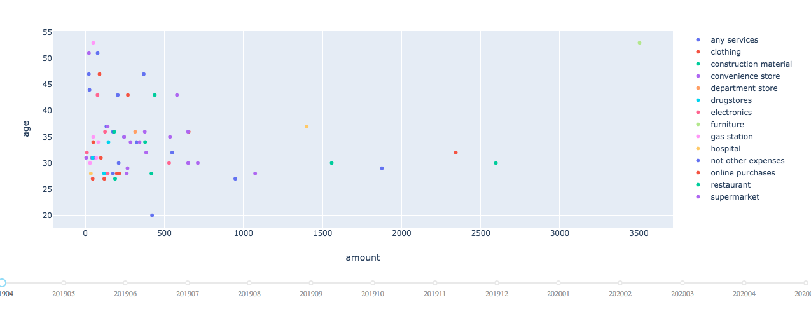
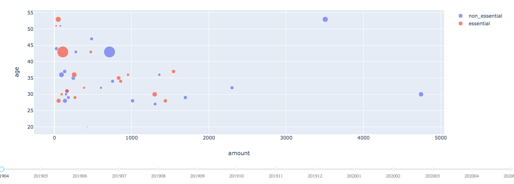
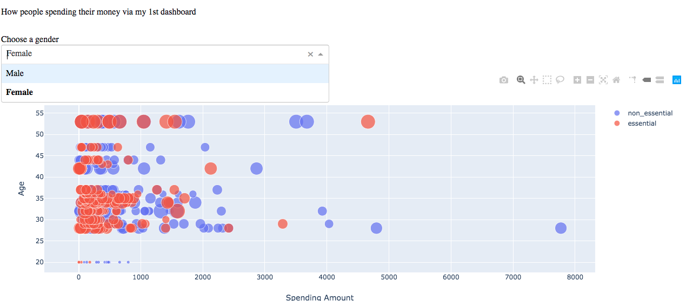

# small-scale--projects

This repo is being updated weekly with small projects that I will write. 

**Alberta webscraping.ipynb** is scraping the Alberta volunteer jobs from https://www.volunteerconnector.org.

**COVID_Label_for_jobs.ipynb** aims to find out a job has related to COVID19 or not.

**Finding city and provinces from Postal Code.ipynb** returns the city and the province of a record based on postal code using pgeocode.

**WebScraping-VolunteerMatch.ipynb** is scraping volunteer jobs from https://www.volunteermatch.org.

**card spending dashboards.ipynb** is three dashboards about how people spends through their credit cards.

